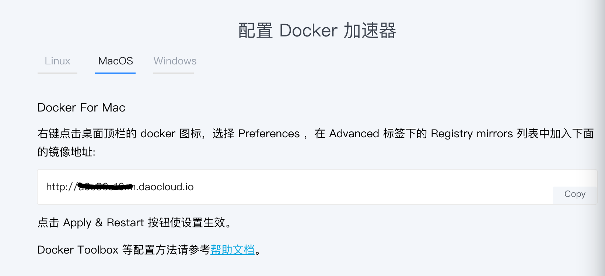
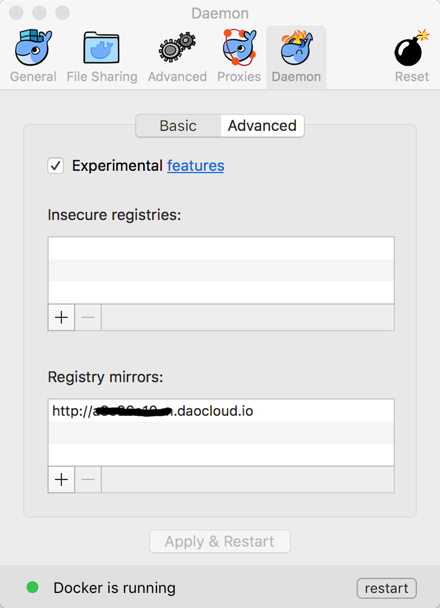

# dotfiles
---

### 解决 ssh 频繁断连

在 Server 端:

```bash
# 打开
sudo vim /etc/ssh/sshd_config
# 添加
ClientAliveInterval 30
ClientAliveCountMax 6
```

iterm2终端: `profiles -> sessions -> 勾选 When idel, send ASCII code`

在 Client 端:
新建 `~/.ssh/config` 文件，加入一行

```
ServerAliveInterval 60
```

### SSH key authentication

```bash
 ssh-copy-id -i $HOME/.ssh/id_rsa.pub USER@192.168.1.198
```

### docker pull images 加速

方式比较多

1. DaoCloud加速器
  免费注册[DaoCloud](https://www.daocloud.io) 账号，进入[加速器页面](https://www.daocloud.io/mirror#accelerator-doc)
  按照提示操作，对于MacOS 打开顶部 docker图标-->Preferences-->Daemon-->Registry mirrors 添加加速器 url，然后 restart docker
  
  
2. Http 代理
3. 阿里云
4. proxychain (效果不佳)

### 删除 mac os app 的数据

```shell
rm -rf ~/Library/Cache/<app package name>
rm -rf ~/Library/Saved\ Application\ State/<app package name>
rm -rf ~/Library/Application\ Support/<app package name>
```
